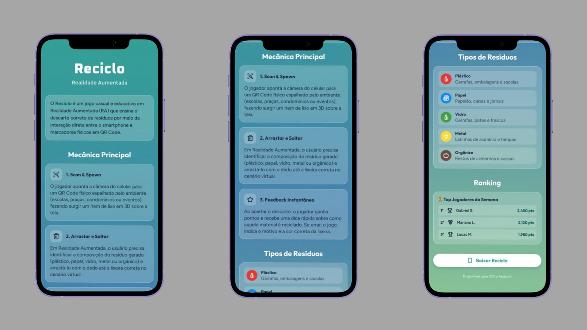

# Reciclo

Solução de educação ambiental focada na destinação correta e outros processos de resíduos sólidos e urbano. Atrelado ao programa LixoZero no IFB.

## Baixando projeto

Para baixar o projeto em sua máquina, basta selecionar no ```.code``` e utilizar o formato que preferir para baixar o repositório ou utilizar o git da seguinte forma:

```bash
git clone https://gitlab.com/reciclo/reciclo.git
cd reciclo
code .
```

## Ferramentas utilizadas no projeto
* JavaScript
* HTML e CSS
* RV&RA
* Git
* Gitlab


## Colaboradores

* [Professora Simone Pinheiros](https://docs.gitlab.com/user/project/merge_requests/auto_merge/) | Product Owner
* [Maria Clara Barroso de Carvalho](https://linkedin.com/in/mariaclarab) | Desenvolvedora
* [Daniela Almeida](https://gitlab.com/danie-la-if/) | Desenvolvedora e Negociadora
* [Natália Oliveira](https://linkedin.com/in/nataliapdo) | Desenvolvedora e Suporte
* [Vínicius Henrique](https://docs.gitlab.com/user/project/merge_requests/approvals/) | Desenvolvedor e Design


## Imagens


## Licença
Projeto open source ainda estamos definindo uma licença.

## Status do projeto :construction:
Versão 1.0.0
